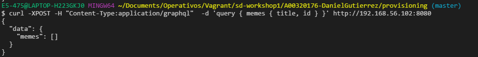
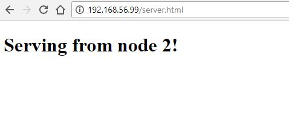
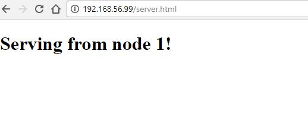

# sd-workshop1 - Daniel Gutierrez A00320176
Repositorio para la entrega del taller 1 de sistemas distribuidos

Aplicacion web distribuida

## Arquitectura


## Comandos utilizados

### NodeJS 

| Comando  | Descripcion | 
| ------------- | ------------- |
| `curl --silent --location https://rpm.nodesource.com/setup_8.x  \| sudo bash -` | Obtener repositorio para poder instalar NodeJS 8|
| `sudo yum -y install nodejs` | Instalar NodeJS |
| `sudo yum -y install nodejs` | Instalar NodeJS |

### GraphQL (Los archivos del servidor se van a copiar a la maquina usando Chef)

| Comando  | Descripcion | 
| ------------- | ------------- |
| `mkdir -p /home/vagrant/graphql-server/server` | Crear carpetas para el servidor  |
| `mkdir -p /home/vagrant/graphql-server/bin` | Crear carpetas para el servidor |
| `mkdir -p /home/vagrant/graphql-server/dist` |Crear carpetas para el servidor|
| `npm install --prefix /home/vagrant/graphql-server/` |Instalar las dependencias descritas en el archivo package.json copiado previamente al directorio usando Chef|
| `firewall-cmd --zone=public --add-port=80/tcp --permanent`&&`firewall-cmd --zone=public --add-port=8080/tcp --permanent`&& `firewall-cmd --zone=public --add-port=4000/tcp --permanent`| Abrir puertos  |
| `service firewalld restart` |Reiniciar firewall  |


### MongoDB (Los archivos de MongoDB se van a copiar a la maquina usando Chef)

| Comando  | Descripcion | 
| ------------- | ------------- |
| `cp MongoDB.repo /etc/yum.repos.d/mongodb-org-3.2.repo` | Se necesita el copiar el archivo con la informacion de repositorio de MongoDB, ubicado en directorio cookbooks/mongodb/files/default/MongoDB.repo |
| `yum  install -y mongodb-org` |Instalar MongoDB  |

### **Iniciar MongoDB y servidor GraphQL**

| Comando  | Descripcion | 
| ------------- | ------------- |
| `service mongod enable && service mongod start` |Iniciar servicio de MongoDB  |
| `npm run production --prefix /home/vagrant/graphql-server/ &` |Correr script para generar archivos de produccion del servidor GraphQL e iniciarlo en segundo plano  |


### Apache

| Comando  | Descripcion | 
| ------------- | ------------- |
| `yum install -y httpd` | Instalar apache |
| `service httpd enable && service httpd start` | Iniciar servicio de apache|
| `service firewalld enable && service firewalld start` | Iniciar firewall|
| `firewall-cmd --zone=public --add-port=80/tcp --permanent` | Abrir puerto|
| `service firewalld restart` | Reiniciar firewall |
| `service httpd restart` | Reiniciar Apache |


### Aplicacion web de prueba

| Comando  | Descripcion | 
| ------------- | ------------- |
| `mkdir -p /home/vagrant/client/` | Crear directorio para instalar la aplicacion |
| `git clone https://github.com/dgutierrez1/apollo-angular2-example.git /home/vagrant/client/` | Descargar la aplicacion web |
| `npm install --prefix /home/vagrant/client/apollo-angular2-example/` | Instalar todas las dependencias de la aplicacion  |
| `npm run production --prefix /home/vagrant/client/apollo-angular2-example/` | Correr script para construir los archivos de produccion y pasarlos al directorio /var/www/html/ de Apache |

## Tecnologias

| Tecnologia  | Descripcion | Referencia |
| ------------- | ------------- | ------------- |
| NodeJS | Runtime de Javascript basado en el motor de Chrome. Es orientado a asincrono y eventos, diseñado para construir aplicaciones de red escalables. En vez de generar un nuevo hilo de OS para cada conexión (y de asignarle la memoria acompañante), cada conexión dispara una ejecución de evento dentro del proceso del motor de Node. A su vez no se permiten bloqueos y casi ninguna funcion realiza direrctamente E/S, entonces nunca se bloquea el proceso | https://nodejs.org/en/|
|GraphQL |GraphQL es un lenguaje de query para su API y un runtime del lado del servidor para ejecutar consultas usando un sistema de tipado para sus datos. GraphQL no está vinculado a ninguna base de datos o motor de almacenamiento, está respaldado por su código y datos existentes.|http://graphql.org/ |
|MongoDB| MongoDB is a document database with scalability and flexibility. It stores data in flexible, JSON-like documents, meaning fields can vary from document to document and data structure can be changed over time. Its distributed database at its core, so high availability, horizontal scaling, and geographic distribution are built in and easy to use |https://www.mongodb.com/|
|Mongoose| Mongoose is a MongoDB object modeling tool designed to work in an asynchronous environment.|http://mongoosejs.com/ |
|Babel|Babel es una herramienta comunitaria que te ayuda a escribir código en la última versión de JavaScript. Cuando los entornos de trabajo no admiten determinadas funciones de forma nativa, Babel ayudará a compilar esas características a versión compatible.|https://babeljs.io/|
|Apollo|El equipo de Apollo construye y mantiene una colección de utilidades diseñadas para facilitar el uso de GraphQL en una gama de tecnologías front-end y de servidor. Aunque esta guía se centra en la integración con Angular, existe una guía similar en las obras de React, y el núcleo del paquete JavaScript de apollo-client puede utilizarse también en muchos otros contextos.|http://dev.apollodata.com/|
|Angular4|Angular es una plataforma que facilita la creación de aplicaciones con la web. Angular combina plantillas declarativas, inyección de dependencia, herramientas de extremo a extremo y prácticas recomendadas integradas para resolver desafíos de desarrollo. Angular capacita a los desarrolladores para crear aplicaciones que viven en la web, en el móvil o en el escritorio||
|Apache|Open-source HTTP server for modern operating systems including UNIX and Windows|https://httpd.apache.org/|
|HAProxy|HAProxy es una solución gratuita, muy rápida y confiable que ofrece alta disponibilidad, equilibrio de carga y proxy para aplicaciones basadas en TCP y HTTP. Es especialmente adecuado para sitios web de muy alto tráfico y potencia a muchos de los más visitados del mundo. Con el paso de los años, se ha convertido en el estándar de facto de equilibrador de carga de código abierto, ahora se distribuye con la mayoría de las distribuciones mainstream de Linux, ya menudo se implementa por defecto en las plataformas en la nube.|http://www.haproxy.org/|
||||


## Usando Vagrant

### Vagrantfile

```ruby
# -*- mode: ruby -*-
# vi: set ft=ruby :

VAGRANTFILE_API_VERSION = "2"

Vagrant.configure(VAGRANTFILE_API_VERSION) do |config|
  config.ssh.insert_key = false
  
  #DATABASE SERVER
  config.vm.define :db_server do |db|
    db.vm.box = "Centos1704v2"
    db.vm.network :private_network, ip: "192.168.56.102"
    #client.vm.network "public_network", bridge: "eth4", ip:"192.168.131.101", netmask: "255.255.255.0"
    db.vm.provider :virtualbox do |vb|
      vb.customize ["modifyvm", :id, "--memory", "512","--cpus", "1", "--name", "db_server" ]
    end
    config.vm.provision :chef_solo do |chef|
      chef.cookbooks_path = "cookbooks"
      chef.add_recipe "graphql"
      chef.add_recipe "mongodb"
    end
  
  end
  
  # WEB SERVER 1
  config.vm.define :wb_server1 do |wb1|
    wb1.vm.box = "Centos1704v2"
    wb1.vm.network :private_network, ip: "192.168.56.100"
    #server.vm.network "public_network", bridge: "eth4", ip:"192.168.131.100", netmask: "255.255.255.0"
    wb1.vm.provider :virtualbox do |vb|
      vb.customize ["modifyvm", :id, "--memory", "512","--cpus", "1", "--name", "wb_server1" ]
    end
    config.vm.provision :chef_solo do |chef|
      chef.cookbooks_path = "cookbooks"
      chef.add_recipe "httpd"
      chef.add_recipe "client-app"
      
      chef.json = {"service_name" => "Serving from node 1"}
      
      
    end
  end

  #WEB SERVER 2
  config.vm.define :wb_server2 do |wb2|
    wb2.vm.box = "Centos1704v2"
    wb2.vm.network :private_network, ip: "192.168.56.101"
    #server.vm.network "public_network", bridge: "eth4", ip:"192.168.131.100", netmask: "255.255.255.0"
    wb2.vm.provider :virtualbox do |vb|
      vb.customize ["modifyvm", :id, "--memory", "512","--cpus", "1", "--name", "wb_server2" ]
    end
    config.vm.provision :chef_solo do |chef|
      chef.cookbooks_path = "cookbooks"
      chef.add_recipe "httpd"
      chef.add_recipe "client-app"
      
      chef.json = {"service_name" => "Serving from node 2"}
      
    end
  end

  
  # LOAD BALANCER
  config.vm.define :lb_server do |lb|
    lb.vm.box = "Centos1704v2"
    lb.vm.network :private_network, ip: "192.168.56.99"
    lb.vm.provider :virtualbox do |vb|
      vb.customize ["modifyvm", :id, "--memory", "512","--cpus", "1", "--name", "lb_server" ]
    end
    config.vm.provision :chef_solo do |chef|
      chef.install = false
      chef.cookbooks_path = "cookbooks"
      chef.add_recipe "haproxy"
      chef.json = {
        "web_servers" => [
          {"ip":"192.168.56.100"},
          {"ip":"192.168.56.101"}
         ]
      }
    end
  end
end
```

## Aprovisinamiento con Chef (cookbooks)

Se muestra en el orden que idealmente deberia seguir el aprovisionamiento
### 1. GraphQL

Directorio  `cookbooks/graphql`

| Receta  | Funciones | Maquina aprovisionada |
| ------------- | ------------- | ------------- |
| graphql_install.rb | <ul><li>Instalar nodejs</li><li>Crear directorios donde se van a copiar los archivos del servidor</li><li>Pasar el archivo `package.json` donde estan las dependencias y scripts que se deben ejecutar posteriormente</li><li>Instalar las dependencias con el comando `npm install --prefix /home/vagrant/graphql-server/`</li></ul> | db_server |
| graphql_config.rb | <ul><li>Pasar todos los archivos del servidor</li><li>Configurar el firewall</li></ul> | db_server |


### 2. MongoDB

Directorio  `cookbooks/mongodb`

| Receta  | Funciones | Maquina aprovisionada |
| ------------- | ------------- | ------------- |
| mongodb_install.rb |  <ul><li>Pasar el archivo con la informacion del repositorio de CentOS</li><li>Instalar MongoDB</li><li>Pasar el archivo con la conexion a la base de datos y creacion del Schema y modelos</li></ul>  | db_server |
| mongodb_config.rb | <ul><li>Iniciar servicio de MongoDB</li><li>Iniciar servidor y todo lo que requiera con el comando `npm run production --prefix /home/vagrant/graphql-server/ `</li></ul> | db_server |

### 3. Apache HTTP

Directorio  `cookbooks/httpd`

| Receta  | Funciones | Maquina aprovisionada |
| ------------- | ------------- | ------------- |
| httpd_install.rb | <ul><li>Instalar Apache</li></ul> | <ul><li>wb_server1</li><li>wb_server2</li></ul>  |
| httpd_config.rb | <ul><li>Iniciar servicio httpd</li><li>Inicar y configrar el firewall</li></ul> | <ul><li>wb_server1</li><li>wb_server2</li></ul>  |
| httpd_files.rb | <ul><li>Usando el cookbook template, se pasa un archivo con la informacion del servidor al cual se le hizo la peticion. Se puede acceder al archivo en `http://ip-servidor/server.html`</li></ul> | <ul><li>wb_server1</li><li>wb_server2</li></ul>  |

### 4. ClientApp

Directorio  `cookbooks/client-app`

| Receta  | Funciones | Maquina aprovisionada |
| ------------- | ------------- | ------------- |    
| default.rb | <ul><li>Instalar NodeJS</li><li>Crear directorios donde se va copiar la aplicacion</li><li>Instalar Git</li><li>Bajar las fuentes de la aplicacion desde el repositorio `https://github.com/dgutierrez1/apollo-angular2-example.git`</li><li><Instalar dependencias de la aplicacion con el comando `npm install --prefix /home/vagrant/client/apollo-angular2-example/`/li><li>Con el comando `npm run production --prefix /home/vagrant/client/apollo-angular2-example/`, crear los archivos de produccion y copiarlos al directorio `var/www/html` para que Apache haga el hosting</li></ul> | <ul><li>wb_server1</li><li>wb_server2</li></ul> |

### 5. HAProxy

Directorio  `cookbooks/haproxy`

| Receta  | Funciones | Maquina aprovisionada |
| ------------- | ------------- | ------------- |   
| haproxy_install.rb | <ul><li>Instalar HAProxy</li></ul> | <ul><li>lb_server</li></ul> |   
| haproxy_config.rb | <ul><li>Usando cookbook template, crear el archivo de configuracion de HAProxy con la informacion de las ips de los web servers (wb_server1 y wb_server2)</li><li>Iniciar servicio de HAProxy</li></ul> | <ul><li>lb_server</li></ul> |   


## Pruebas

### DATABASE_SERVER (db_server)

Creando la maquina


Peticion al servidor GraphQL con la base de datos vacia




Creacion de dos items usando una mutation en GraphQL


Peticion despues de que se crearan los items, variando los atributos requeridos en la respuesta


### WEB SERVERS (wb_server1 & wb_server2)
Creando la maquina **wb_server1** `ip:192.168.56.100`


Template creado para el Web Server 1


Accediendo a la aplicacion con el Web Server 2. Se ven los items creados previamente usando cURL


Creando un nuevo item a traves de la aplicacion


Nuevo item visualizandose en la lista de items


Creando la maquina **wb_server2** `ip:192.168.56.101`


Template creado para el Web Server 2
 


Accediendo a la aplicacion con el Web Server 2


Accediendo desde el balancedor de carga **lb_server** `ip:192.168.56.99`


A traves del balancedor de carga accediendo a ambos web servers






